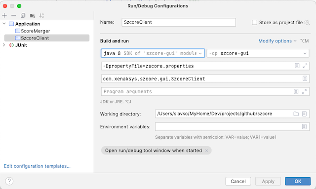

# ZScore

**Networked composition and performance system**

ZScore Server and Control GUI builds require the latest versions of Java 8 and Maven 3

Please note - slightly misleading module name "szcore" is used for historical reasons.

## Modules

Java code is split into three Maven modules:

- **szcore-core**
- **szcore-engine** (server)
- **szcore-gui**  (client)

Directory szcore-client contains Adobe Illustrator scripts used for score authoring.

Module szcore-player is not used currently.

To build the project use standard Maven commands.

## How to run

The main class that runs integrated client/server process is:

`com.xenaksys.szcore.gui.SzcoreClient`

It can be found in szcore-gui module and requires the classpath specified in the resources MANIFEST.MF

The default application configuration is stored in:

`szcore-engine/src/main/resources/zscore.properties`

It should be enough to override properties "webScoreRoot" and "webAudienceRoot" in the properties file to point to the
correct web content root (available in **zsweb** repository)

To use a different configuration file, add program argument "propertyFile" to the command line:

`-DpropertyFile=<file-path>`

### Intellij Run config illustration

